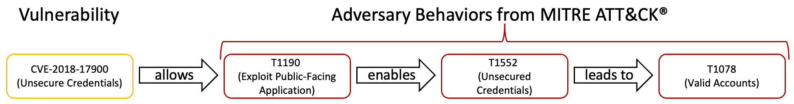

# Mitre ATT&CK Impact Tags - A docker Service

This project is a Proof of Concept to show how you can use the Tenable API and a SQLite DB to solve some powerful use cases.  
Wrapping a simple python script into a docker container makes it easy to deploy and reduces deployment risks.  
It also means you don't need to be a developer or a scripter to take advantage of its power.

# Why?

The github project: ["Mapping MITRE ATT&CK® to CVEs for Impact"](https://github.com/center-for-threat-informed-defense/attack_to_cve) does an amazing job connecting CVEs to impact using Mitre ATT&CK framework.
The goal with this project is to decorate your Tenable.io assets with this impact data to help you further understand your attack surface and risk.

# How it works

The script parses the CSV created from the above github project and tags each asset with three tags for each CVE.  The three tags are to indicate the advesary behaviors in the picture below.
The primary impact enables the secondary impact which leads to the exploit technique.

# What does it do?

The script uses the built in tag functionality in navi to tag each asset.

Navi uses a SQLite database and the Tenable.io tag assignments endpoint to accomplish everything below.  To make these dynamic, put the container command or the script on a cronjob or scheduled task.

Note: The Category : Value pair follow the Tag description.  This is what will be seen in Tenable.io should the tag exist.  The Tag is not created if no assets match the navi search.

The script/service tags assets in the below format:

* Mitre : Primary Impact: { Technique ID(s) }
* Mitre : Secondary Impact: { Technique ID(s) }
* Mitre : Exploit Technique: { Technique ID(s) }

# Docker command
    docker run -d packetchaos/mitre_tags {your Access Key} {your secret Key}

